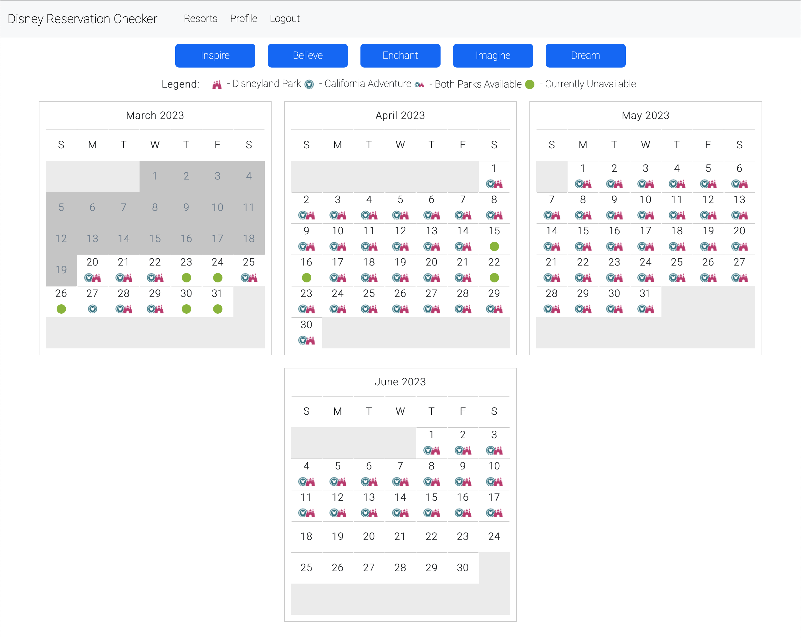
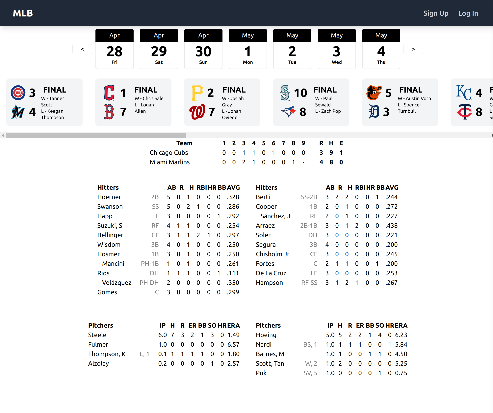

<article> I'm a former English Professor with a passion for exploring how things work, from language and literature to bikes, electronics, and cars. I thrive when I have a difficult problem to solve, and I love to learn new things. My background in teaching and academic research has given me a strong foundation in critical thinking, problem solving, and communication, and I'm excited to apply these skills to a career in software development. </article>

<h1>Skills</h1>

<table>
    <thead>
        <th> Languages </th>
            <th> Frameworks </th>
            <th> Databases </th>
            <th> Tools </th>
            <th> Libraries </th>   
    </thead>
    <tbody>
        <tr>
            <td> JavaScript </td>
            <td> ReactJS </td>
            <td> MongoDB </td>
            <td> VS Code </td>
            <td> Bootstrap </td>
        </tr>
        <tr>
            <td> Python </td>
            <td> Django </td>
            <td> PostgreSQL </td>
            <td> Git </td>
            <td> Tailwind </td>
        </tr>
        <tr>
            <td> HTML5 </td>
            <td> Node.js </td>
            <td>  </td>
            <td> GitHub </td>
            <td> jQuery </td>
        </tr>
        <tr>
            <td> CSS </td>
            <td> Express </td>
            <td>  </td>
            <td> Heroku </td>
            <td>  </td>
        </tr>
    </tbody>
</table>

<h1> PROJECTS </h1>

<h2> <a href='https://github.com/jimcreel/disneyReservationChecker'>Disney Reservation App Code</a></h2>

 

<h3> Mongoose/Express/Node </h3>
<article> 
    The Disney reservation checker is a MEN stack app styled with the Bootstrap CSS library. The site pulls publicly available reservation data from Disney websites and displays it for the
    user filtered by resort, park, date, and annual pass. Requires a Google account to use.
    Users can also choose to receive an email notification when a reservation becomes available, powered by a python script that runs on an AWS EC2 instance.
</article>
<h3> Check out the deployed site here: <a href='https://magic-reservations.herokuapp.com'> Disney Reservation Checker</h3></a>

 

 

<h2><a href='https://github.com/jimcreel/mlbScores'> MLB Scores, Stats, and Info</a></h2>

<h3> Mongoose/Express/React/Node </h3>
<article> 
    A full stack app that pulls MLB data from the MLB Stats API and displays it for the user. Users can view the current day's scores, standings, and stats for each team. For my capstone project, I wanted to challenge myself to anticipate how elements would land on the page and how they would interact with each other. I also wanted to create a clean, minimalist design that would be easy to navigate and use. Baseball has a visual rhetoric that is difficult to display, but I am really pleased with the outcome here. I used the Tailwind CSS library to style the app.
</article>
<h3> Check out the deployed site here: <a href='https://mlbinfo.herokuapp.com'> Major League Baseball Info</h3></a>

 

 

 

<h2><a href='https://github.com/jimcreel/brickbybrick'> Brick By Brick</a></h2>

<h3> Django Team Project </h3>
<article> 
    Brick By Brick is a Django app powered by a PostgreSQL database, built in collaboration with <a href="https://github.com/garyzhuo">Gary Zhuo</a> and <a href="https://github.com/nangel42">Nicolas Angel</a>. I served as the database and backend manager for the team, and was responsible for maintaining and deploying the repo. The app allows users to create an account and add LEGO sets to their collection. Collections allow users to manage their own inventory down to individual parts, as well as see what other sets they can build with the parts they already own. One of the many themes of my projects at General Assembly was that I wanted to work with large real-world datasets, and the LEGO database was the most challenging. With over 1M parts, 50k sets, and innumerable part relationships, modeling and seeding the database was a huge undertaking. I'm really proud of the work we did here, and I'm excited to continue to build on it.
</article>
<h3> Check out the deployed site here: <a href='https://brickbybrick.herokuapp.com'> Brick By Brick</h3></a>

 

 

<h1> Portfolio/Contact Info </h1>

 Portfolio: <a href="https://jimcreel.github.io">Jim Creel</a> 

 LinkedIn: <a href="https://www.linkedin.com/in/jim-creel/">Jim Creel</a> 

 Email: <a href="mailto:jim.creel@gmail.com">jim.creel@gmail.com</a>

